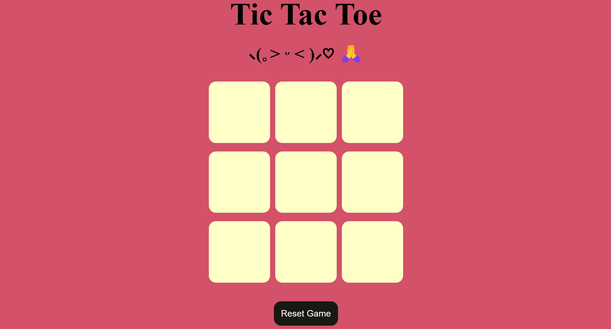
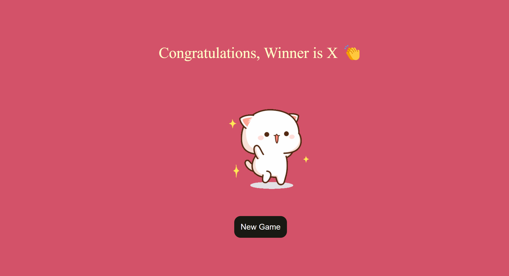
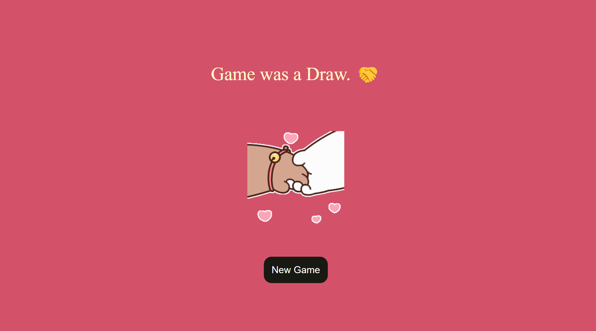

# Tic-Tac-Toe-Game

# Overview
This project implements the classic **Tic-Tac-Toe** game using HTML, CSS, and JavaScript. It allows two players to play the game in a web browser.

# Features
<ul>
  <li>Start the game with 'O' as the first player.</li>
  <li>Displays "O wins" or "X wins" when a player achieves three in a row.</li>
  <li>Shows a congratulations GIF upon winning,</li>
  <li>Displays "Draw" when no player wins.</li>
  <li>Shows a handshake GIF upon a draw.</li>
  <li>Additional features include options for starting a new game and resetting the current game.</li>
</ul>
 
# How to Play
<ul>
   <li>The game starts with player 'O'.</li>
   <li>Players take turns clicking on the board to place their marks ('O' or 'X').</li>
   <li>Win by getting three of your symbols ('O' or 'X') in a row horizontally, vertically, or diagonally.</li>
   <li>When a game ends:  </li>
   <li>If 'O' wins: Display "O wins" and a congratulations GIF. </li>
   <li>If 'X' wins: Display "X wins" and a congratulations GIF. </li>
   <li>If it's a draw: Display "Draw" and a handshake GIF. </li>
   <li>Choose to start a new game or reset the current game after it ends. </li>
</ul>

# Application Screenshots

 
